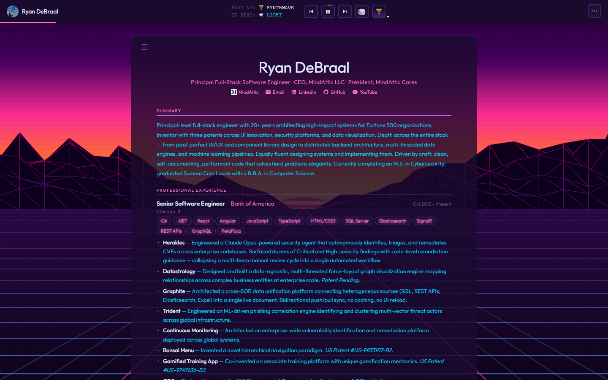
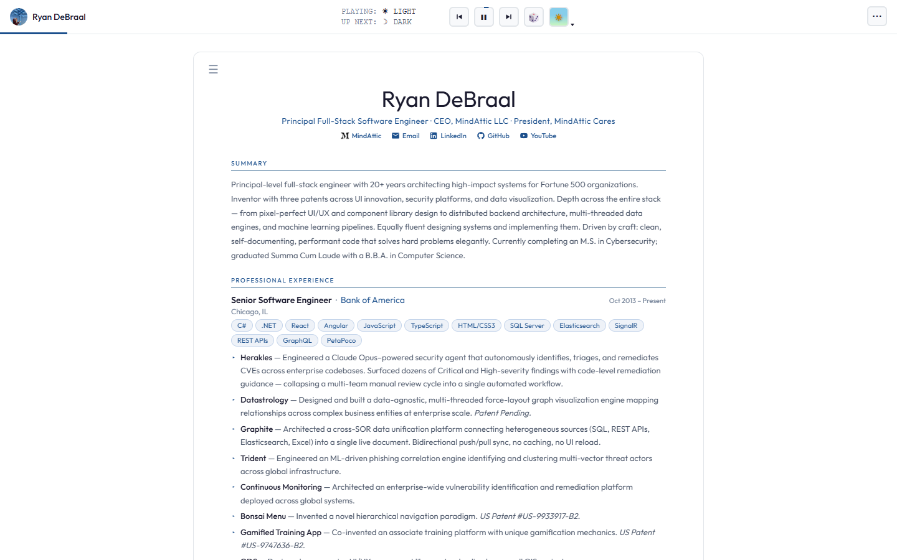
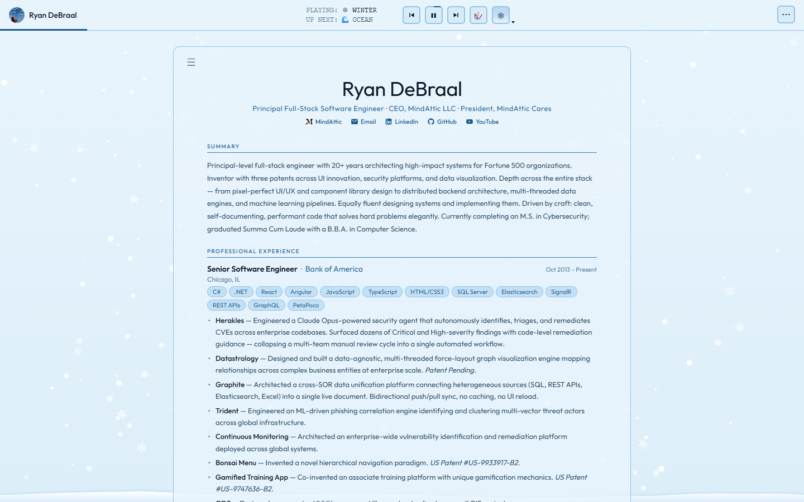

# ryandebraal.com

A resume that is its own work sample: one hand-authored HTML page with 16 animated themes, 3 profiles, hover tooltips for 447 technologies, and Markdown, HTML and PDF export, with no build step.

[](index.htm) [](index.htm) [](index.htm) [](docs/BIBLE.md) [](https://ryandebraal.com)



Try it: [ryandebraal.com](https://ryandebraal.com)

## Why

- A resume that proves the claims on it. Every animation frame and export pipeline is in the file you can read end to end in an afternoon.
- One set of content, three audiences. Switch between a classic, a pitch and a complete view of the same data with one click.
- Take it with you in the format the reader wants: Markdown, standalone HTML, PDF or a print layout, straight from the toolbar.
- Nothing between you and the page. The file you edit is byte for byte the file the browser runs: no bundler, no framework, no `npm install`.
- No tracking. Open the Network tab and you see the page, its fonts, images and theme art from `cdn.jsdelivr.net`, and html2pdf.js only when you export a PDF.

## Features



### Themes

- 16 themes: Light, Dark, Spring, Summer, Autumn, Winter, Matrix, Neko, Ocean, Sunset, Forest, Cyberpunk, Noir, Sakura, Sand and Synthwave.
- Theme switching is CSS custom properties only, never a JavaScript style mutation ([RDC-LAW-4](docs/BIBLE.md#RDC-LAW-4)).
- A theme player in the toolbar shows what is playing and what is up next, and rotates through themes until you pause it.
- Custom Canvas 2D animations per theme, written from scratch with no animation library: bees with a flower-claiming state machine, snow that settles into SVG drifts, ten roaming Neko cats with the full 1998 sprite state machine (all 32 frames kept inline as tiny base64 CSS classes), sandstorm physics, parallax forest silhouettes, a perspective synthwave grid, neon acid-rain cyberpunk skylines and more.
- `light`, `dark` and `noir` are static CSS-only themes with no bespoke effects.
- An adaptive quality step (`fx-quality-level`) scales the effects back on slower machines.



### Profiles

- Three rendering profiles, `classic`, `pitch` and `complete`, each a different view of the same resume data.
- `render()` reprojects the one data object for the chosen audience ([RDC-LAW-5](docs/BIBLE.md#RDC-LAW-5)).

### Tech tooltips

- Hover any technology tag in the skills or experience sections for a short description and where it was used.
- 447 entries live in one `tooltips` object.
- Skill tags have a per-skill familiarity level you can cycle; it is remembered.

### Export

- Markdown (`exportMD`), standalone HTML (`exportHTML`) and PDF (`exportPDF`).
- Print layouts: `exportPrintPage`, `exportPrintDocument`, `exportPrintCV` and `printResume`.
- PDF export loads html2pdf.js 0.10.2 from jsDelivr on first use only.

### Everything else

- The Outfit typeface from the CDN: weights 100 to 900 as two woff2 subsets (latin and latin-ext) hosted in MindAttic.UiUx and served by jsDelivr at a pinned tag. The latin file is preloaded. No Google Fonts request.
- Preferences persist in `localStorage`: theme, profile, font choice, theme timeout and transition, and per-skill familiarity.
- A mobile-first toolbar that adapts between desktop and portrait orientations.
- A DevTools easter egg: an ASCII banner printed to the console.

## Quick start

You need a modern browser and a network connection (fonts, portrait and theme art load from jsDelivr).

```powershell
git clone https://github.com/mindattic/ryandebraal.com
cd ryandebraal.com
start index.htm
```

That's it. There is no dev server, because there is nothing to compile. You should see the resume with the theme player running in the toolbar. Use the player buttons to step through themes; profiles, settings and export are in the toolbar menus.

## How it works

`index.htm` is a single hand-authored page (about 7,000 lines, about 0.47 MB on disk). Fonts, the portrait, the theme backgrounds and the PDF library are not embedded; they load from jsDelivr at a pinned MindAttic.UiUx tag ([RDC-LAW-1](docs/BIBLE.md#RDC-LAW-1)).

```text
index.htm  (one page)
├── <!-- Last Updated: <UTC> -->     stamped by the deploy pipeline (MindAttic.Deploy)
├── <head>
│   ├── DevTools easter-egg banner (ASCII, shown via console.log)
│   └── <style>
│       ├── CSS custom properties per [data-theme]
│       ├── layout + toolbar rules
│       └── @font-face Outfit (CDN woff2, weights 100-900) + Neko 32 inline frames
├── <body data-theme=… data-profile=…>
│   ├── resume DOM mount + toolbar
│   ├── per-theme <canvas> FX layers
│   └── <script>                      one IIFE-scoped global block
│       ├── § DATA        const D = {…}              (the resume content)
│       ├── § TOOLTIPS    const tooltips = {…}        (447 tech entries)
│       ├── § RENDER      secHTML / expHTML / projHTML / eduHTML / patHTML / corpHTML /
│       │                 skillsHTML / tag / buildTooltip / render()  (pure string builders)
│       ├── § STATE       setTheme / setProfile / cycleTheme / pickTheme / cycleProfile /
│       │                 filterSkills / cycleTagLevel / saveSkillFam / resetDefaults /
│       │                 startThemeRotation / stopThemeRotation / toggleThemeRotation
│       ├── § FX ENGINE   one start<Theme>() Canvas 2D initializer per animated theme,
│       │                 driven by requestAnimationFrame; resizeCanvas / stopFX manage lifecycle
│       └── § EXPORT      exportMD() · exportHTML() · runPdfExport(opts) with named wrappers
│                         exportPDF() / exportPrintPage() / exportPrintDocument() /
│                         exportPrintCV() · printResume() · toggleExportMenu / toggleMoreMenu
```

This mirrors [docs/BIBLE.md §4](docs/BIBLE.md#RDC-§4), the canonical version of this diagram. If the architecture changes, update that file first, then this section.

## Content model

All resume content lives once, as a single in-file JavaScript object literal named `D` (`index.htm`, near line 1592). Every profile and export format is a read-only projection of this one object; there is never a second copy of the content.

| Key | What it holds |
|---|---|
| `summary`, `pitchSummary` | Prose blurbs (full and pitch tone) |
| `skillsCore`, `skillsComplete` | Grouped skill lists (label and `items[]`) |
| `experience[]` | Title, company, location, dates, `tech[]` and `bullets[]` per role |
| `projects[]` | Name, URL and label per link: currently the MindAttic GitHub organisation and MindAttic books on Amazon |
| `education[]` | Degrees |
| `patents[]` | US patents |
| `corporate[]` | Registered entities |

A sibling object, `tooltips` (`index.htm`, lines 977 to 1463), maps 447 technology names to hover descriptions.

## Themes and profiles reference

- Theme names: `light`, `dark`, `spring`, `summer`, `autumn`, `winter`, `matrix`, `neko`, `ocean`, `sunset`, `forest`, `cyberpunk`, `noir`, `sakura`, `sand`, `synthwave`. Selected with the `[data-theme]` attribute on `<html>`.
- Profile names: `classic`, `pitch`, `complete`. Selected with `[data-profile]` on `<body>`.
- `localStorage` keys: `resume-settings` (all Settings-panel values, including theme timeout and transition), `resume-theme`, `tag-familiarity`, `neko-color` and `fx-quality-level`. Theme-rotation pause lasts for one visit and is not saved.

## Assets and CDN

Static assets live in the sibling MindAttic.UiUx repo and are served by jsDelivr at a whole-number tag. The page currently pins `V10`.

- Page art: `https://cdn.jsdelivr.net/gh/mindattic/MindAttic.UiUx@V10/ryandebraal.com/<category>/<file>` (`themes/<name>/<name>-NN.jpg`, `images/`, `icons/`).
- Shared fonts: `https://cdn.jsdelivr.net/gh/mindattic/MindAttic.UiUx@V10/fonts/outfit/outfit-latin.woff2` (and `outfit-latin-ext.woff2`).
- PDF export: html2pdf.js 0.10.2 from jsDelivr npm, loaded on first export.

Names are lowercase kebab-case; JPEGs are never re-encoded. To add or change an asset:

1. Put it in MindAttic.UiUx under `ryandebraal.com/<category>/`.
2. Regenerate its `assets-manifest.json` with `tools\build-asset-manifest.ps1` in that repo, and commit.
3. Run the linked `/deploy`: it tags the next whole-number release, pushes it, rewrites the `@V<n>` pins in `index.htm` and checks the CDN before uploading.

Full conventions: [docs/BIBLE.md §10](docs/BIBLE.md#RDC-§10).

## Not in this repo

No `node_modules`. No `package.json`. No `webpack.config.js`. No `tsconfig.json`. No `.eslintrc`. No CI matrix. No Tailwind. No React. No Vite. No analytics SDK. No tracking pixels. No service worker. No polyfills. No minifier. No transpiler. No third-party fonts. Assets come only from the pinned jsDelivr paths allowed by [RDC-LAW-3](docs/BIBLE.md#RDC-LAW-3). No test suite, no compiler, no build command (see [docs/BIBLE.md §3](docs/BIBLE.md#RDC-§3)).

No per-project `deploy.ps1`, `deploy.bat` or `settings.json`: deploy is centralised in the sibling MindAttic.Deploy repo ([RDC-LAW-6](docs/BIBLE.md#RDC-LAW-6)).

## Project layout

```text
ryandebraal.com/
├── index.htm              The entire hand-authored page (assets are hosted in MindAttic.UiUx)
├── README.md              This file
├── README.htm             Generated from README.md by tools/build-readme.ps1
├── AGENTS.md              Project agent entrypoint
├── CLAUDE.md              Provider forwarder to the MindAttic agent standard
├── docs/
│   ├── BIBLE.md           L0: what the site is and is not, architecture, the Laws (RDC-LAW-n)
│   ├── AMENDMENTS.md      L1: pending decisions not yet folded into the bible (normally empty)
│   ├── USER_STORIES.md    L2: capabilities and status (RDC-US-<Epic><n>)
│   ├── BIBLE.digest.md    GENERATED by tools/codex.ps1 digest, never hand-edited
│   ├── images/            README screenshots
│   └── rfc/
│       └── 0001-in-browser-smoke-harness.md
├── tools/
│   ├── codex.ps1          Codex doctor and digest tool
│   └── build-readme.ps1   Regenerates README.htm (thin wrapper, see below)
└── .claude/
    ├── settings.json, settings.local.json, launch.json, statusline.ps1
    ├── commands/          deploy.md, quicksave.md, quickload.md
    ├── hooks/             inject-digest.ps1, quickload-on-do.ps1
    └── skills/            commit/, deploy/, discard/, revert/, run/ (each a SKILL.md)
```

## Tooling

| Script | Purpose |
|---|---|
| `tools/codex.ps1` | Codex CLI for this repo. `doctor` validates the `docs/` canon (front-matter, IDs, cross-references, cited tests and paths, digest freshness) and exits non-zero on any hard error. `digest` regenerates `docs/BIBLE.digest.md` from BIBLE §1, §3, §5 and §9 plus a status index and any pending decisions. Pure Windows PowerShell 5.1, no external modules. |
| `tools/build-readme.ps1` | Thin wrapper that regenerates `README.htm` from `README.md` by delegating to the shared engine at `../codex-standard/build-readme.ps1` (workspace root, outside this repo). Every MindAttic repo carries an identical wrapper, so all `README.htm` files share one engine. |

```powershell
powershell -NoProfile -ExecutionPolicy Bypass -File tools\codex.ps1 doctor
powershell -NoProfile -ExecutionPolicy Bypass -File tools\codex.ps1 digest
powershell -NoProfile -ExecutionPolicy Bypass -File tools\build-readme.ps1
```

`doctor` must exit 0 after any change under `docs/`. `README.htm` is a generated, developer-facing rendering of this file and is unrelated to the site's `index.htm`, which is the shipped product.

## Deployment

Deploy with the `/deploy` command (`.claude/commands/deploy.md`), which shells out to the sibling MindAttic.Deploy repo. This site is part of the permanently linked group `mindattic-web` (MindAttic.UiUx, ryandebraal.com, mindatticcares.com and mindattic.com): deploying any one of them deploys all four, in one run.

```powershell
powershell -NoProfile -ExecutionPolicy Bypass -Command "cd D:\Projects\MindAttic\MindAttic.Deploy; npm run deploy -- --site ryandebraal.com"
```

The run:

1. Publishes the MindAttic.UiUx package first (tags the next `V<n>` if it has unreleased commits and pushes the tag).
2. Pins that tag in every site's `index.htm`.
3. Verifies every asset is live on jsDelivr, byte for byte.
4. Only then stamps the `Last Updated` comment and FTPS-uploads `index.htm` to the site root, followed by mindatticcares.com and mindattic.com.

`--dry-run` previews the whole run without changing anything; `--no-link` deploys this site alone. The deploy never commits or pushes this repo. This site's profile lives in `MindAttic.Deploy/projects.json` under `sites[]`; FTP credentials are centralised in MindAttic.Deploy.

## Limitations

- No automated test suite yet. Every user story is held at "shipped, manually verified" because this project has no build step by design ([RDC-LAW-2](docs/BIBLE.md#RDC-LAW-2)).
- [RFC 0001](docs/rfc/0001-in-browser-smoke-harness.md) proposes a dependency-free in-browser smoke harness covering every theme, profile and export (extending the MindAttic.UiUx Playwright suite, or an in-page `?selftest=1` block). It is planned, not built.

## Documentation

This repo follows the MindAttic Codex documentation standard (project code RDC). A fact lives in exactly one layer; deeper detail is linked by stable ID, never duplicated here.

- [docs/BIBLE.md](docs/BIBLE.md) (L0): what the site is and is not, the architecture (§4) and the project Laws `RDC-LAW-1` to `RDC-LAW-6`.
- [docs/AMENDMENTS.md](docs/AMENDMENTS.md) (L1): decisions not yet folded into the bible; normally empty. Git history is the change record.
- [`docs/USER_STORIES.md`](docs/USER_STORIES.md) (L2): capabilities by epic, each with its verification status.
- [docs/rfc](docs/rfc/): open design notes; once decided they are folded into the bible and stories and deleted.
- [docs/BIBLE.digest.md](docs/BIBLE.digest.md): generated by `tools/codex.ps1 digest`. Never hand-edit it.
- Org-wide laws: [MindAttic.HouseRules.md](../MindAttic.HouseRules.md), inherited by reference from BIBLE §5 (whole-number versioning, credentials never in code or commits, "done is verified, not asserted").
- Agent instructions: [AGENTS.md](AGENTS.md) is the project's agent entrypoint. `CLAUDE.md` is a provider forwarder to the workspace-wide `MINDATTIC_AGENT.md` and `mindattic-agent-standard/AGENTS.md`; neither duplicates workflow. The `.claude/` folder holds the Claude Code commands, hooks, skills and status line listed in [Project layout](#project-layout).

## License

This repo has no LICENSE file. All rights reserved. Built and maintained by [Ryan DeBraal](https://ryandebraal.com).

---

Part of [MindAttic](https://mindattic.com) — see more projects at [github.com/mindattic](https://github.com/mindattic). Related: [mindattic.com](https://github.com/mindattic/mindattic.com), [mindatticcares.com](https://github.com/mindattic/mindatticcares.com), [MindAttic.UiUx](https://github.com/mindattic/MindAttic.UiUx), [MindAttic.Deploy](https://github.com/mindattic/MindAttic.Deploy).
